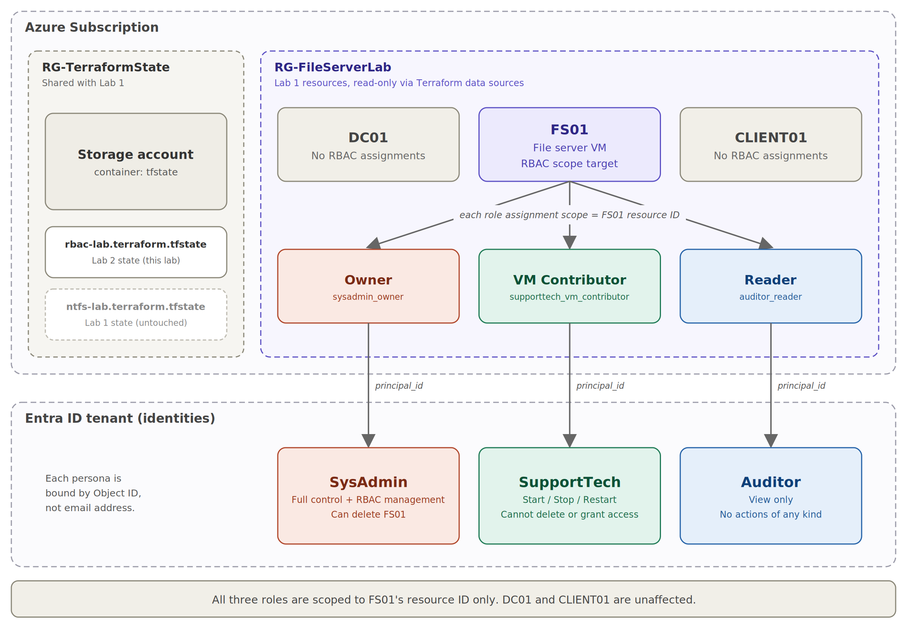
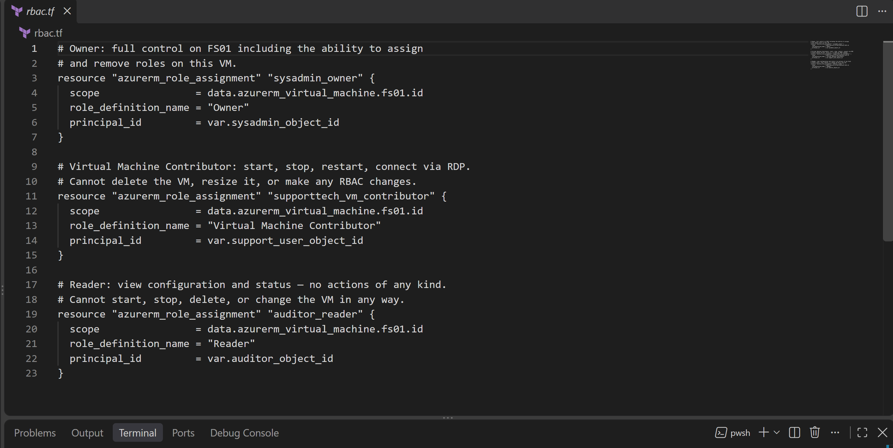
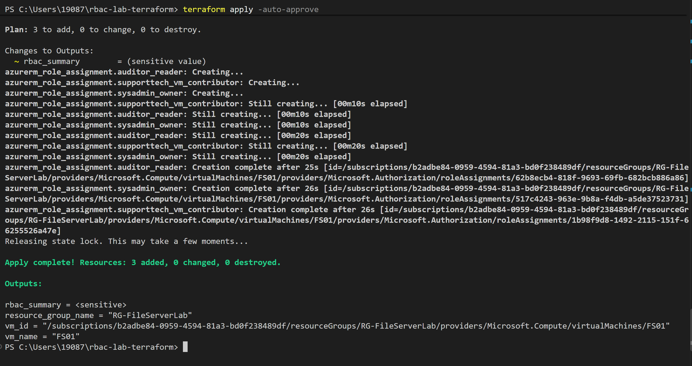
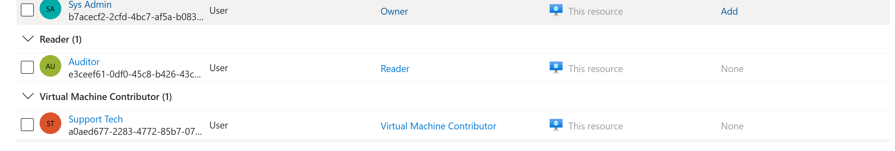
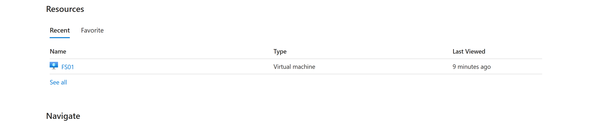
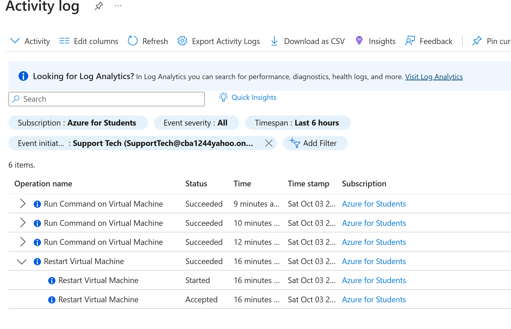
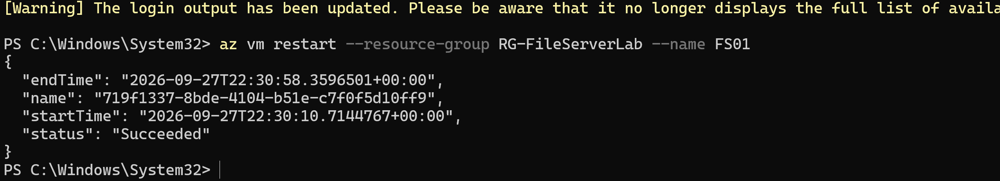
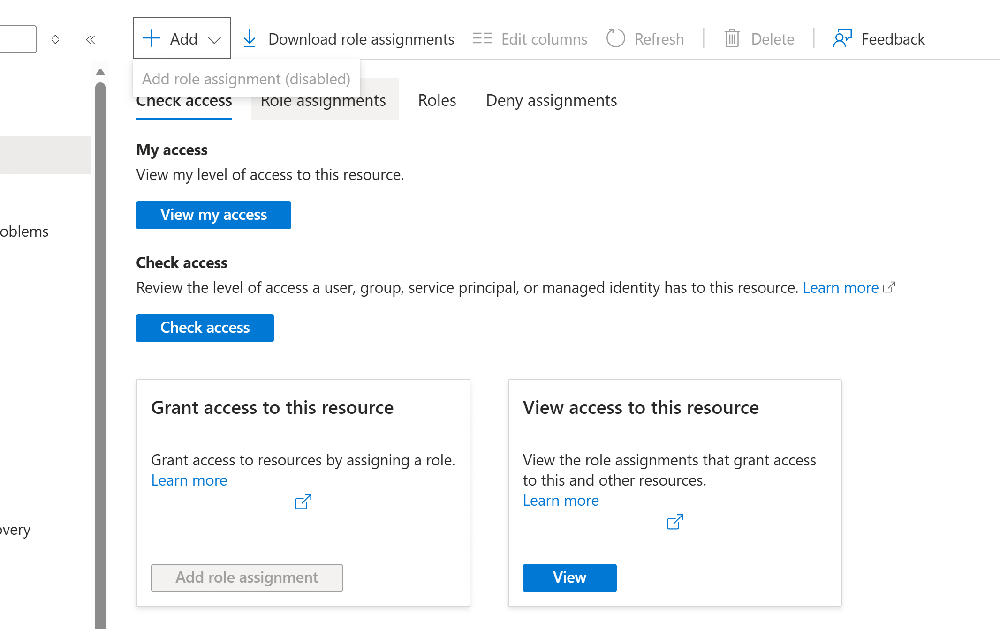
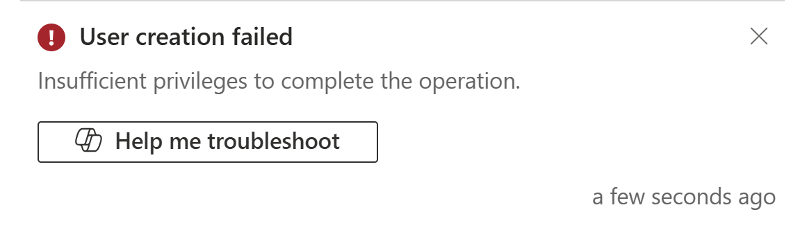

# Lab 2 — Azure RBAC Access Control

Layering Azure-level access control on top of the file server from Lab 1, scoped to a single VM, using three real personas: a SysAdmin with full control, a SupportTech who can restart but not delete, and an Auditor who can only look.


## 🎥 Demo Video
[Watch me build this lab end-to-end →](https://www.loom.com/share/fac1e2e3537b4b0eb3959cb9b808f232)

## Overview

| Field | Value |
|---|---|
| Depends on | Lab 1 (NTFS File Server) must be fully deployed, `RG-FileServerLab` and `FS01` must exist |
| What gets created | 3 role assignments on FS01 only, no new VMs, no new networking |
| Deploy time | Under 1 minute |
| Cost | Role assignments are free, only Lab 1's VMs incur compute charges |
| Tools used | Terraform, Azure CLI, PowerShell, Azure AD (Entra ID), Azure RBAC |
| Career relevance | Systems Administrator, Cloud Security Engineer, Identity and Access Management |

This lab is fully self-contained. Every Terraform file and PowerShell script needed to reproduce it is included below.

## The Problem This Lab Solves

Lab 1 controlled who can access files inside a VM. This lab solves a completely different problem: controlling who can manage the VM itself from Azure.

In a real organization, different people need different levels of control over cloud infrastructure. A senior sysadmin needs full control: start, stop, resize, delete, and manage who else can access a server. A help desk technician needs to restart a server when it's unresponsive, but should never be able to delete it or change its security configuration. An auditor needs to view server details for compliance reporting but shouldn't be able to take any action at all.

Azure RBAC (Role-Based Access Control) is how Azure enforces this separation. Every action in Azure, starting a VM, reading its configuration, assigning a role, requires a specific permission. RBAC lets you assign exactly what a person needs for their job and nothing more. This is the principle of least privilege applied at the cloud infrastructure level.

This lab builds that model end to end: three personas, three roles, one VM, fully scoped, tested, and validated.

## The Real-World Scenario

A help desk ticket comes in: the Finance file server is unresponsive. The on-call technician logs into Azure and restarts the VM, but cannot delete it, cannot change its configuration, and cannot see who else has access to it. Later, an auditor runs a quarterly review and exports the RBAC report confirming only authorized personnel have access. After a staff change, the senior sysadmin uses Owner rights to reassign roles. Each persona has exactly what their job requires. No one has more. This is RBAC enforcing least privilege in practice.

## How This Lab Connects to Lab 1

This lab deploys **zero new infrastructure**. It reads Lab 1's resource group and FS01 VM using Terraform data sources, references that never modify the underlying resources, then layers three role assignments directly onto FS01's resource ID. It reuses Lab 1's remote state storage account with a separate state key, so a `terraform destroy` here can never accidentally tear down Lab 1's VMs. This is the same pattern larger organizations use when a security or identity team needs to manage access controls on infrastructure that a separate sysadmin team already owns.

## What You Learn Building This

| Skill | Why it matters in a real environment |
|---|---|
| Understand the difference between RBAC and NTFS | RBAC controls the infrastructure from outside. NTFS controls files inside the OS. A file server with perfect NTFS permissions but no RBAC control is still a risk, anyone with a portal login could start, stop, or delete the VM |
| Scope role assignments to a single resource | Scoping to a single VM's resource ID means the assignment only affects that one VM. Real environments use the narrowest possible scope to limit blast radius if an account is compromised |
| Use Terraform data sources to reference existing infrastructure | Data sources let Terraform read existing resources without recreating or modifying them, the pattern used when one team's Terraform references another team's infrastructure |
| Look up Azure AD Object IDs | Every RBAC role assignment requires the Object ID of the principal. Knowing how to retrieve these correctly, and why email addresses aren't sufficient, is a prerequisite for any production RBAC work |
| Test role enforcement with the Azure CLI | The login-as-user CLI pattern lets you verify what a specific identity can and cannot do. This is how you confirm least privilege is actually enforced, not just assumed |
| Produce a structured validation report | Automated validation that exports a structured file is the professional standard for compliance work. Manually checking the portal is neither auditable nor repeatable |

## Architecture

Azure RBAC operates at the Resource Manager control plane, completely separate from the NTFS permissions inside the VM's OS. All three role assignments are scoped to FS01's resource ID only. DC01 and CLIENT01 sit in the same resource group but have no assignments in this lab.



## Why Each Component Exists

| Component | What it does and why it's needed |
|---|---|
| `data.tf`, data sources | Looks up Lab 1's resource group and FS01 VM by name, reads them, never modifies them. Terraform cannot create role assignments without FS01's full Azure resource ID. If Lab 1 isn't deployed, these sources fail with a clear error |
| `rbac.tf`, role assignments | Creates three role assignments scoped to FS01's resource ID. The scope line is the single most important line in each assignment. Pointing it at the resource group ID would silently expand the role to every resource in RG-FileServerLab |
| Owner role | Full control on FS01 including managing RBAC assignments. In production you'd typically assign Contributor and User Access Administrator separately to follow least privilege more precisely |
| Virtual Machine Contributor role | Start, stop, restart, connect to FS01, cannot delete or manage RBAC. The appropriate role for help desk staff who manage VM availability but not configuration |
| Reader role | View FS01's configuration and status, no actions of any kind. Appropriate for auditors and compliance teams who need visibility without risk |
| `variables.tf`, Object ID inputs with no defaults | If these variables had defaults, a careless deploy would assign roles to placeholder identities. No defaults means Terraform errors out loudly if they're not provided, a deliberate safety design |
| `01-get-object-ids.ps1` | Translates user email addresses to Azure AD Object IDs. Email addresses can change, Object IDs never do. This script automates the lookup instead of finding them manually in the portal |
| `validate-lab.ps1` | Confirms all three role assignments are active and prints a permission matrix. RBAC propagation can take several minutes after `terraform apply`, this script confirms the assignments are actually live, not just that Terraform said it created them |
| Separate state key (`rbac-lab.terraform.tfstate`) | Keeps Lab 2's state separate from Lab 1's in the same storage container. If both labs used the same state key, Lab 2's `terraform destroy` would remove Lab 1's resources |

## Prerequisites

```bash
terraform -version   # Must be >= 1.5.0
az version           # Azure CLI, any recent version

# Confirm correct subscription
az account show
# If wrong: az account set --subscription "<name or ID>"

# Confirm Lab 1 VMs are running
az vm list -g RG-FileServerLab --query "[].{name:name,status:powerState}" -o table
# All three must show: VM running
# If stopped: az vm start --ids $(az vm list -g RG-FileServerLab --query "[].id" -o tsv)
```

## Step 1 — Project Folder Structure

Create a separate folder from Lab 1. Even though Lab 2 references Lab 1's resources, they're completely independent Terraform projects and must never share a folder or a state key.

```powershell
New-Item -ItemType Directory -Path "$HOME\rbac-lab-terraform"
cd "$HOME\rbac-lab-terraform"
New-Item -ItemType Directory -Path scripts
```

```
rbac-lab-terraform/
├── backend.tf                     ← reuses Lab 1 storage account, different state key
├── versions.tf                    ← provider version requirements
├── variables.tf                   ← three Object ID inputs with no defaults
├── data.tf                        ← reads Lab 1 resource group and FS01 without modifying them
├── rbac.tf                        ← the three role assignments scoped to FS01
├── outputs.tf                     ← VM ID, resource group, role assignment IDs
├── terraform.tfvars.example       ← safe template, commit this
├── terraform.tfvars               ← your real Object IDs, never commit this
├── .gitignore
├── validate-lab.ps1                ← confirms assignments, prints permission matrix, exports report
└── scripts/
    └── 01-get-object-ids.ps1       ← translates user emails to Azure AD Object IDs
```

## Step 2 — Terraform Files

### `backend.tf`

No new storage account needed. Replace `REPLACE_WITH_YOUR_LAB1_STORAGE_ACCOUNT_NAME` with the same storage account name used in Lab 1. The only difference from Lab 1's `backend.tf` is the key value.

```hcl
terraform {
  backend "azurerm" {
    resource_group_name  = "RG-TerraformState"
    storage_account_name = "REPLACE_WITH_YOUR_LAB1_STORAGE_ACCOUNT_NAME"
    container_name       = "tfstate"
    key                  = "rbac-lab.terraform.tfstate"
    # Lab 1 uses: ntfs-lab.terraform.tfstate
    # Both files live in the same container without touching each other
  }
}
```

### `versions.tf`

```hcl
terraform {
  required_version = ">= 1.5.0"
  required_providers {
    azurerm = { source = "hashicorp/azurerm" version = "~> 3.0" }
  }
}

provider "azurerm" { features {} }
```

### `variables.tf`

The three Object ID variables have no default values, intentionally. This forces explicit input. `resource_group_name` and `vm_name` must match Lab 1 exactly, including capitalization.

```hcl
variable "resource_group_name" {
  description = "Must match Lab 1 exactly — case-sensitive."
  type        = string
  default     = "RG-FileServerLab"
}

variable "vm_name" {
  description = "Must match Lab 1 exactly — case-sensitive."
  type        = string
  default     = "FS01"
}

variable "location" {
  type    = string
  default = "Central US"
}

variable "sysadmin_object_id" {
  description = "Azure AD Object ID for SysAdmin — receives Owner role on FS01."
  type        = string
}

variable "support_user_object_id" {
  description = "Azure AD Object ID for SupportTech — receives VM Contributor role on FS01."
  type        = string
}

variable "auditor_object_id" {
  description = "Azure AD Object ID for Auditor — receives Reader role on FS01."
  type        = string
}
```

### `data.tf`

```hcl
# Read Lab 1's resource group — gives us the subscription context
data "azurerm_resource_group" "lab" {
  name = var.resource_group_name
}

# Read FS01 by name — gives us its full Azure resource ID.
# That ID is the scope for all three role assignments in rbac.tf.
# Scoping to the VM resource ID = role applies ONLY to FS01.
# Scoping to the resource group ID = role applies to DC01, FS01, CLIENT01, and everything else.
data "azurerm_virtual_machine" "fs01" {
  name                = var.vm_name
  resource_group_name = data.azurerm_resource_group.lab.name
}
```

### `rbac.tf`

The scope field is what makes each role apply to FS01 only. Changing it to the resource group ID would silently expand the role to every resource in the group.

```hcl
# Owner: full control on FS01 including the ability to assign
# and remove roles on this VM.
resource "azurerm_role_assignment" "sysadmin_owner" {
  scope                = data.azurerm_virtual_machine.fs01.id
  role_definition_name = "Owner"
  principal_id          = var.sysadmin_object_id
}

# Virtual Machine Contributor: start, stop, restart, connect via RDP.
# Cannot delete the VM, resize it, or make any RBAC changes.
resource "azurerm_role_assignment" "supporttech_vm_contributor" {
  scope                = data.azurerm_virtual_machine.fs01.id
  role_definition_name = "Virtual Machine Contributor"
  principal_id          = var.support_user_object_id
}

# Reader: view configuration and status — no actions of any kind.
# Cannot start, stop, delete, or change the VM in any way.
resource "azurerm_role_assignment" "auditor_reader" {
  scope                = data.azurerm_virtual_machine.fs01.id
  role_definition_name = "Reader"
  principal_id          = var.auditor_object_id
}
```

### `outputs.tf`

```hcl
output "resource_group_name" { value = data.azurerm_resource_group.lab.name }
output "vm_name" { value = data.azurerm_virtual_machine.fs01.name }
output "vm_id" {
  value       = data.azurerm_virtual_machine.fs01.id
  description = "Full resource ID — the scope all three role assignments use."
}

output "rbac_summary" {
  sensitive   = true
  description = "Role assignment IDs — view with: terraform output -json rbac_summary"
  value = {
    owner       = azurerm_role_assignment.sysadmin_owner.id
    contributor = azurerm_role_assignment.supporttech_vm_contributor.id
    reader      = azurerm_role_assignment.auditor_reader.id
  }
}
```

### `terraform.tfvars.example`

Safe to commit. Fill in the real `terraform.tfvars` (not this file) with actual Object IDs after running `01-get-object-ids.ps1` in Step 3.

```hcl
resource_group_name = "RG-FileServerLab"   # Case-sensitive — must match Lab 1 exactly
vm_name              = "FS01"               # Case-sensitive — must match Lab 1 exactly
location             = "Central US"

# Object IDs for your three test users.
# Run .\scripts\01-get-object-ids.ps1 to get these values.
sysadmin_object_id      = "REPLACE_WITH_SYSADMIN_OBJECT_ID"
support_user_object_id  = "REPLACE_WITH_SUPPORTTECH_OBJECT_ID"
auditor_object_id       = "REPLACE_WITH_AUDITOR_OBJECT_ID"
```

### `.gitignore`

```
terraform.tfvars
*.tfvars
!terraform.tfvars.example
terraform.tfstate
terraform.tfstate.backup
*.tfstate
.terraform/
.terraform.lock.hcl
*.tfplan
RBAC_Lab_Report.txt
```

## Step 3 — Create the Scripts

### `scripts/01-get-object-ids.ps1`

Terraform needs the Object ID (GUID) for each user, not their email address. Object IDs are the immutable internal identifier for an identity in Azure AD. They never change even if the user's email does.

```powershell
Write-Host "`nAzure AD Object ID Lookup" -ForegroundColor Cyan
Write-Host "Enter the UPN (email address) for each lab user when prompted.`n"

$roles = @(
  @{ Label="SysAdmin (Owner)"; VarName="sysadmin_object_id" },
  @{ Label="SupportTech (VM Contributor)"; VarName="support_user_object_id" },
  @{ Label="Auditor (Reader)"; VarName="auditor_object_id" })

$results = @()
foreach ($role in $roles) {
  $upn = (Read-Host "Enter UPN for $($role.Label)").Trim()
  try {
    $objectId = az ad user show --id $upn --query id -o tsv 2>$null
    if (-not $objectId -or $LASTEXITCODE -ne 0) {
      Write-Warning "Could not find user: $upn — check the email and try again."
      $objectId = "NOT_FOUND"
    }
  } catch { $objectId = "ERROR" }
  $results += @{ VarName=$role.VarName; ObjectId=$objectId }
  Write-Host " Found: $objectId" -ForegroundColor Green
}

Write-Host "`n=== Paste these into terraform.tfvars ===" -ForegroundColor Yellow
foreach ($r in $results) {
  Write-Host "$($r.VarName.PadRight(25)) = `"$($r.ObjectId)`""
}
```

### `validate-lab.ps1`

Why validate separately from `terraform apply`? Because `terraform apply` confirms Terraform created the assignment resource, it does not confirm Azure RBAC actually propagated the permission. These are two different systems. This script queries the live RBAC state directly.

```powershell
param([string]$ResourceGroup="RG-FileServerLab", [string]$VMName="FS01")

Write-Host "`n=== RBAC Lab Validation ===" -ForegroundColor Cyan

# Get FS01's resource ID
$vmId = az vm show -g $ResourceGroup -n $VMName --query id -o tsv 2>$null
if (-not $vmId) { throw "VM $VMName not found in $ResourceGroup. Confirm Lab 1 is deployed." }
Write-Host "Scope: $vmId`n"

# Query live role assignments on FS01
$assignments = az role assignment list --scope $vmId `
  --query "[].{role:roleDefinitionName,principal:principalName}" `
  -o json | ConvertFrom-Json

$expected = @(
  @{ Role="Owner"; Label="SysAdmin" },
  @{ Role="Virtual Machine Contributor"; Label="SupportTech" },
  @{ Role="Reader"; Label="Auditor" })

$allPass = $true
Write-Host "[ Role Assignment Validation ]" -ForegroundColor White
foreach ($e in $expected) {
  $match = $assignments | Where-Object { $_.role -eq $e.Role }
  if ($match) { Write-Host " [PASS] $($e.Role) -> $($match.principal)" -ForegroundColor Green }
  else { Write-Host " [FAIL] $($e.Role) not found on $VMName" -ForegroundColor Red; $allPass=$false }
}

# Permission matrix
Write-Host "`n[ Permission Matrix — FS01 scope only ]" -ForegroundColor White
$matrix = @(
  @{ Action="View VM details"; O="Yes"; VC="Yes"; R="Yes" },
  @{ Action="Start / Stop VM"; O="Yes"; VC="Yes"; R="No" },
  @{ Action="Connect via RDP"; O="Yes"; VC="Yes"; R="No" },
  @{ Action="Delete VM"; O="Yes"; VC="No"; R="No" },
  @{ Action="Manage RBAC roles"; O="Yes"; VC="No"; R="No" })

Write-Host (" {0,-26} {1,-8} {2,-20} {3}" -f "Action","Owner","VM Contributor","Reader")
foreach ($row in $matrix) { Write-Host (" {0,-26} {1,-8} {2,-20} {3}" -f $row.Action,$row.O,$row.VC,$row.R) }

# Export report
$report = "RBAC Lab Validation Report`nGenerated: $(Get-Date)`nVM Resource ID: $vmId`n`n"
$report += $assignments | Format-Table -AutoSize | Out-String
$report += "`nOverall: $(if ($allPass){`"ALL PASS`"}else{`"FAILURES DETECTED`"})"
$report | Out-File "./RBAC_Lab_Report.txt" -Encoding UTF8

Write-Host "`nReport exported: RBAC_Lab_Report.txt" -ForegroundColor Cyan
Write-Host "Overall: $(if ($allPass){`"ALL PASS`"}else{`"FAILURES DETECTED`"})" -ForegroundColor $(if ($allPass){"Green"}else{"Red"})
```

## Step 4 — Prepare Your Test Users

You need three existing Azure AD accounts, test accounts, not your own.

| Role assigned | User UPN (email) | Object ID (fill in after running the script) |
|---|---|---|
| SysAdmin — Owner | | |
| SupportTech — VM Contributor | | |
| Auditor — Reader | | |

> **MFA on test accounts:** Step 7 requires `az login` as each test user. If your tenant enforces MFA, create these accounts with a Conditional Access exclusion, or use accounts in a test tenant without MFA.

```powershell
# Run this — it prompts for three UPNs and prints Object IDs to paste into tfvars
.\scripts\01-get-object-ids.ps1
```

## Step 5 — Configure Variables

```powershell
Copy-Item terraform.tfvars.example terraform.tfvars
# Open terraform.tfvars and paste in the three Object IDs from Step 4
# Confirm resource_group_name = "RG-FileServerLab" matches Lab 1 exactly
# Confirm vm_name = "FS01" matches Lab 1 exactly
# Open backend.tf and replace REPLACE_WITH_YOUR_LAB1_STORAGE_ACCOUNT_NAME
```

## Step 6 — Deploy and Validate

```bash
az login && az account show
terraform init
terraform plan   # Must show exactly 3 resources — no VMs, no networking, no resource groups
terraform apply  # Type yes — completes in under 1 minute

# Wait 2 to 3 minutes for RBAC to propagate, then validate
.\validate-lab.ps1
# Confirms all 3 assignments, prints permission matrix, exports RBAC_Lab_Report.txt
```

> If plan shows more than 3 resources, stop. Check `terraform.tfvars`. `resource_group_name` and `vm_name` must be an exact case-sensitive match to your Lab 1 deployment.
>
> If validate shows FAIL after 5 minutes, RBAC propagation can take up to 10 minutes in some tenants. Wait and re-run `validate-lab.ps1`.

## Step 7 — Test As Each Persona

Open a new terminal for each test. Log in as the test user, run the commands, confirm the expected result, then close that terminal. The FAIL results are not errors, they prove the role enforcement is working correctly.

```bash
# ── Test 1: Auditor — Reader ──────────────────────────────────────────
az login   # Log in as your Auditor test account
az vm show -g RG-FileServerLab -n FS01 --query "{name:name,size:hardwareProfile.vmSize}"
# Expected: SUCCEEDS — Reader can view VM details

az vm stop -g RG-FileServerLab -n FS01
# Expected: FAILS — AuthorizationFailed
# This failure confirms the Reader role is working. Auditor cannot stop VMs.

# ── Test 2: SupportTech — VM Contributor ──────────────────────────────
az login   # Log in as your SupportTech test account
az vm start -g RG-FileServerLab -n FS01
# Expected: SUCCEEDS — VM Contributor can start VMs

az role assignment list --scope $(az vm show -g RG-FileServerLab -n FS01 --query id -o tsv)
# Expected: FAILS — AuthorizationFailed
# SupportTech cannot view or manage RBAC assignments.

# ── Test 3: SysAdmin — Owner ──────────────────────────────────────────
az login   # Log in as your SysAdmin test account
az vm show -g RG-FileServerLab -n FS01 --query "{name:name}"
# Expected: SUCCEEDS

az role assignment list --scope $(az vm show -g RG-FileServerLab -n FS01 --query id -o tsv)
# Expected: SUCCEEDS — Owner can view and manage RBAC assignments

# ── Restore your own account ──────────────────────────────────────────
az login          # Log back in as your own account
az account show   # Confirm your subscription is active
```

## Screenshots

### `rbac.tf`: Three Assignments, One Scope


The whole access model fits in 23 lines of Terraform. Every assignment points its `scope` at `data.azurerm_virtual_machine.fs01.id`, so least privilege is defined in version-controlled code instead of being clicked together in the portal.

### `terraform apply`: Exactly 3 Added, Nothing Else Touched


The plan is `3 to add, 0 to change, 0 to destroy`, and every resulting role assignment ID ends in `/virtualMachines/FS01/providers/Microsoft.Authorization/...`. That proves the deployment layered access onto Lab 1's VM without creating, modifying, or destroying any of Lab 1's infrastructure.

### FS01 Access Control (IAM): Three Personas, Three Roles


All three Terraform-created assignments are live on FS01: SysAdmin as Owner, Auditor as Reader, SupportTech as Virtual Machine Contributor. Each shows a scope of **This resource**, not *Inherited*, which proves the roles are pinned to FS01's resource ID and don't spill over to DC01, CLIENT01, or the rest of `RG-FileServerLab`.

### SupportTech's Portal View: FS01 Only


Signed in as SupportTech, the only resource surfaced in the portal is FS01. The account has no footprint anywhere else in the subscription, which is exactly what a help desk login with a single-VM scope should look like.

### Activity Log: Every SupportTech Action Is Attributed


Filtered to SupportTech as the event initiator, the log shows a successful VM restart (Accepted → Started → Succeeded) and three Run Command operations. That proves VM Contributor grants the operational control a help desk tech needs, and that every action is tied to a named identity for later audit. Run Command executes as SYSTEM inside the guest OS, so VM Contributor is more powerful than "restart only." That's worth knowing before handing this role to anyone in production.

### SupportTech Restarts FS01 from the CLI


Logged in as SupportTech, `az vm restart` against FS01 returns `"status": "Succeeded"`. This is the help desk scenario from the top of this README working end to end: an unresponsive server is brought back without escalating to a senior admin.

### SupportTech Cannot Grant Access


On FS01's Access control blade, **Add role assignment** is greyed out for SupportTech. VM Contributor can operate the VM but cannot hand out permissions on it, which closes off the most common path to privilege escalation.

### SupportTech Has No Entra ID Directory Rights


An attempt to create a user in Entra ID fails with *Insufficient privileges*. Azure RBAC roles govern resources, while Entra ID directory roles govern identities, and they're two separate permission systems. A VM role on FS01 grants nothing in the directory.

## Teardown

```bash
# Option A — remove RBAC only, keep Lab 1 VMs running
terraform destroy

# Option B — full teardown, completely done with both labs
terraform destroy                                     # Remove RBAC first
az group delete -n RG-FileServerLab --yes --no-wait   # Remove all Lab 1 resources
az group show -n RG-FileServerLab 2>&1                # Expect: ResourceGroupNotFound
```

## Troubleshooting

| Problem | Cause | Solution |
|---|---|---|
| `terraform apply`: principal not found | Object ID is wrong or the account was deleted | Re-run `01-get-object-ids.ps1`, update `terraform.tfvars`, re-apply |
| `terraform apply`: resource group not found | Lab 1 is not deployed | Deploy the NTFS lab first, `RG-FileServerLab` must exist |
| Validate shows FAIL after 10+ minutes | Role assignment not in Terraform state | Run `terraform state list`, confirm three `azurerm_role_assignment` resources appear. If missing, re-apply |
| `az vm stop` succeeds for Auditor | RBAC still propagating | Wait 5 minutes and retest |
| Plan shows more than 3 resources | `resource_group_name` or `vm_name` mismatch | Check capitalization, `FS01` is not the same as `fs01` |
| MFA prompt when logging in as test user | Tenant enforces MFA | Create a Conditional Access exclusion for test accounts, or use a test tenant without MFA |

## How This Lab Fits Into a Series

| Lab | What it deploys | Relationship |
|---|---|---|
| Lab 1 — NTFS File Server | DC01, FS01, CLIENT01, VNet, NSG, Key Vault in RG-FileServerLab | Standalone, creates all infrastructure from scratch |
| **Lab 2 — Azure RBAC** (this lab) | 3 role assignments on FS01 only, no new VMs | Depends on Lab 1, reads Lab 1 resources via data sources and reuses its storage account |
| AUM Lab — Azure Update Manager | DC01, WS01, WS02, VNet, Key Vault in rg-aumlab | Standalone, fully independent from Lab 1 and Lab 2 |

## Related Labs

- **Lab 1** — NTFS File Server (this lab's prerequisite)
- **Lab 3** — Splunk SIEM & Log Analysis
- **Lab 4** — ServiceNow ITSM
- **Lab 5** — Nessus Vulnerability Scanning
